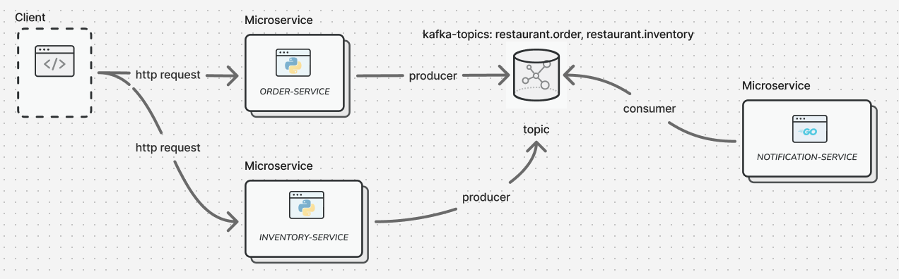

# 📦 Microservicio de Pedidos + Inventario + Consumidor Kafka
Este proyecto contiene un entorno de microservicios que incluye:
- order-service: Microservicio para gestión de pedidos.
- inventory-service: Microservicio para gestión de inventario.
- kafka-consumer-service: Consumidor de eventos Kafka que procesa y reacciona a eventos como envío de correos.
- Apache Kafka y Zookeeper para mensajería entre servicios.

```
.
├── docker-compose.yml
├── order-service/
│   └── .env
├── inventory-service/
│   └── .env
├── kafka-consumer/
│   └── .env

```

# 🚀 ¿Cómo levantar el entorno?
### Requisitos previos:

- Docker y Docker Compose instalados.

- Los servicios deben tener su Dockerfile configurado y archivos .env.

- Ejecuta el entorno completo:
```
docker-compose up --build

```

# 🛑 Detener el entorno
```
docker-compose down


```